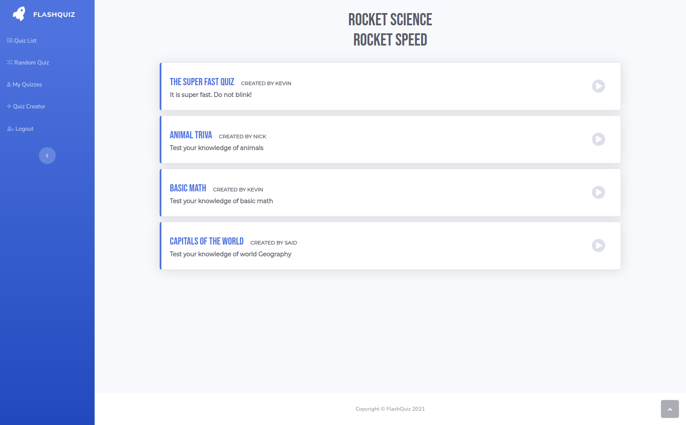
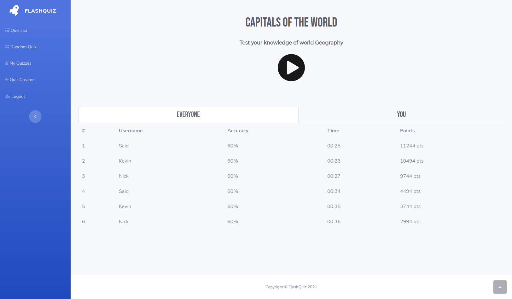
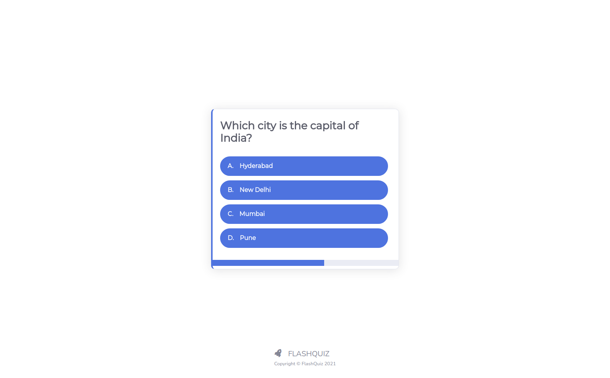
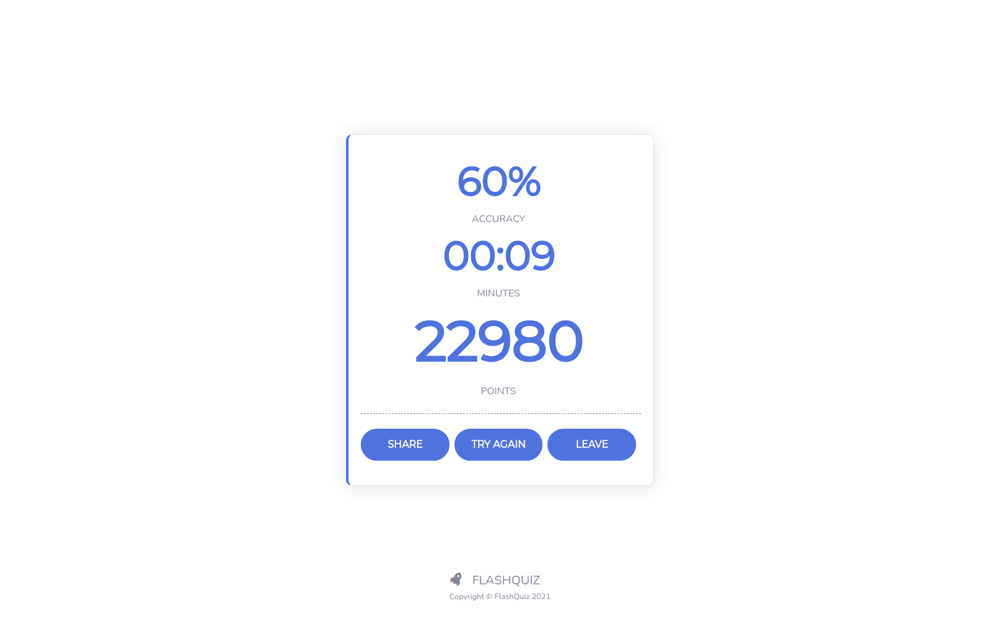
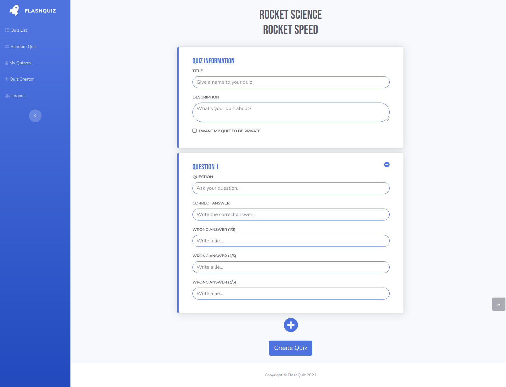
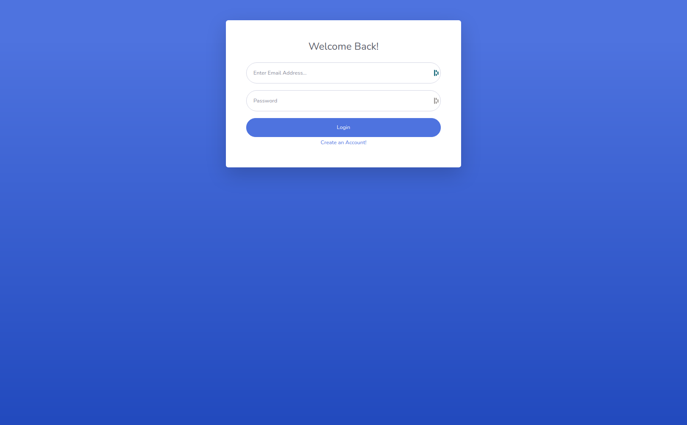
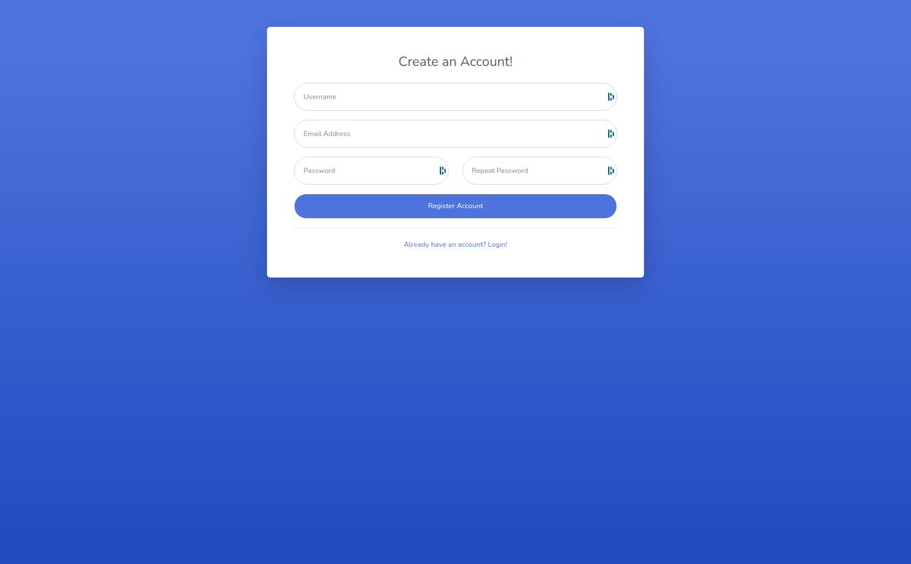

FLASHQUIZ | A Rocket Fast Quiz App
=========

Want to test your knowledge on certain topics? Want to see how you compare against the rest of the world? Well, FlashQuiz will not only test your knowledge but will derive you score based on fast you can answer your questions! If you are quiz enthusiast, you can play, create and share quizzes with your friends!

**WARNING:** You better be fast!

## Screenshots

### Quiz List (Home)

### Quiz Landing Page

### Quiz Play Module - Question

### Quiz Play Module - Results

### Quiz Creator

### Login

### Register

## Getting Started

1. Create the `.env` by using `.env.example` as a reference: `cp .env.example .env`
2. Update the `.env` file with your correct local information 
  - username: `labber` 
  - password: `labber` 
  - database: `midterm`
3. Install dependencies: `npm i`
4. Fix to binaries for sass: `npm rebuild node-sass`
5. Reset database: `npm run db:reset`
7. Run the server: `npm run local`
8. Visit `http://localhost:8080/`
9. Have fun!

## Tech Stack

### BACK END / dependencies

- **npm** (5.x or above)
- **node.js** (12.x or above)
- **node.js**/dependencies
  - body-parser
  - chalk
  - dotenv
  - ejs
  - express
  - morgan
  - node-sass-middleware
  - pg (6.x)
  - pg-native
- **node.js**/devDependencies
  - eslint
  - nodemon
  - prettier
  - prettier-eslint
- **postgresql**
- **psql**

### FRONT END

- **Bootstrap**
- **jQuery** 

### IDE

- **vscode**
- **vscode**/extensions
  - Prettier Eslint
  - Code Spell Checker
  - Better Comments
  - EditorConfig

### DESIGN

- **Figma**
- **Adobe XD**
- **dbdiagram.io**
- **draw.io**
- **Bootstrap Studio**

### COMMUNICATION

- **Basecamp**
- **Discord**

